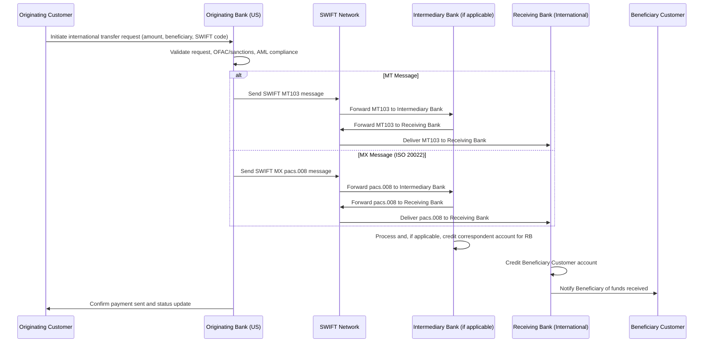

```mermaid
sequenceDiagram
    participant OC as Originating Customer
    participant OB as Originating Bank (US)
    participant SW as SWIFT Network
    participant IB as Intermediary Bank (if applicable)
    participant RB as Receiving Bank (International)
    participant BC as Beneficiary Customer

    OC->>OB: Initiate international transfer request (amount, beneficiary, SWIFT code)
    OB->>OB: Validate request, OFAC/sanctions, AML compliance

    alt MT Message
        OB->>SW: Send SWIFT MT103 message
        SW->>IB: Forward MT103 to Intermediary Bank
        IB->>SW: Forward MT103 to Receiving Bank
        SW->>RB: Deliver MT103 to Receiving Bank
    else MX Message (ISO 20022)
        OB->>SW: Send SWIFT MX pacs.008 message
        SW->>IB: Forward pacs.008 to Intermediary Bank
        IB->>SW: Forward pacs.008 to Receiving Bank
        SW->>RB: Deliver pacs.008 to Receiving Bank
    end

    IB->>IB: Process and, if applicable, credit correspondent account for RB
    RB->>RB: Credit Beneficiary Customer account
    RB->>BC: Notify Beneficiary of funds received
    OB->>OC: Confirm payment sent and status update
```
