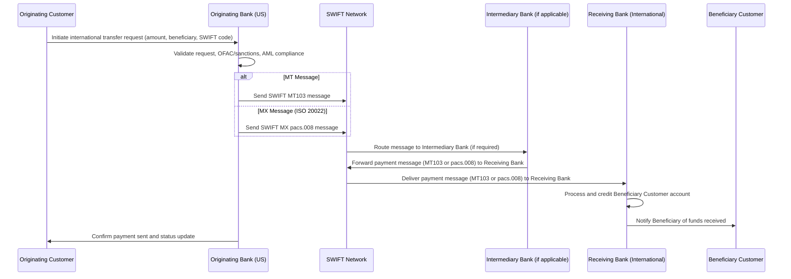

```mermaid
sequenceDiagram
    participant OC as Originating Customer
    participant OB as Originating Bank (US)
    participant SW as SWIFT Network
    participant IB as Intermediary Bank (if applicable)
    participant RB as Receiving Bank (International)
    participant BC as Beneficiary Customer

    OC->>OB: Initiate international transfer request (amount, beneficiary, SWIFT code)
    OB->>OB: Validate request, OFAC/sanctions, AML compliance
    alt MT Message
        OB->>SW: Send SWIFT MT103 message
    else MX Message (ISO 20022)
        OB->>SW: Send SWIFT MX pacs.008 message
    end
    SW->>IB: Route message to Intermediary Bank (if required)
    IB->>SW: Forward payment message (MT103 or pacs.008) to Receiving Bank
    SW->>RB: Deliver payment message (MT103 or pacs.008) to Receiving Bank
    RB->>RB: Process and credit Beneficiary Customer account
    RB->>BC: Notify Beneficiary of funds received
    OB->>OC: Confirm payment sent and status update
```
