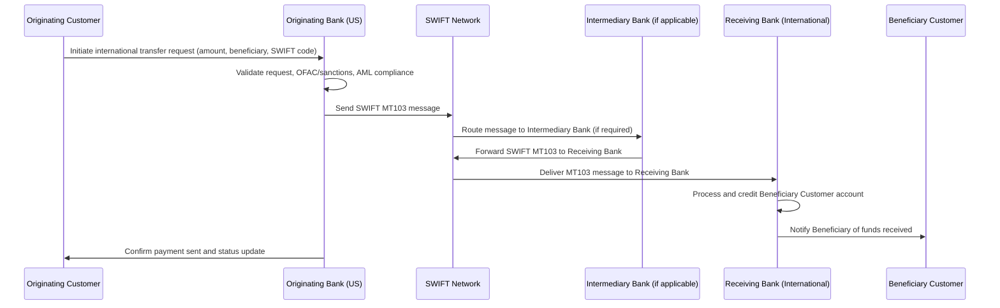

```mermaid
sequenceDiagram
    participant OC as Originating Customer
    participant OB as Originating Bank (US)
    participant SW as SWIFT Network
    participant IB as Intermediary Bank (if applicable)
    participant RB as Receiving Bank (International)
    participant BC as Beneficiary Customer

    OC->>OB: Initiate international transfer request (amount, beneficiary, SWIFT code)
    OB->>OB: Validate request, OFAC/sanctions, AML compliance
    OB->>SW: Send SWIFT MT103 message
    SW->>IB: Route message to Intermediary Bank (if required)
    IB->>SW: Forward SWIFT MT103 to Receiving Bank
    SW->>RB: Deliver MT103 message to Receiving Bank
    RB->>RB: Process and credit Beneficiary Customer account
    RB->>BC: Notify Beneficiary of funds received
    OB->>OC: Confirm payment sent and status update
```
